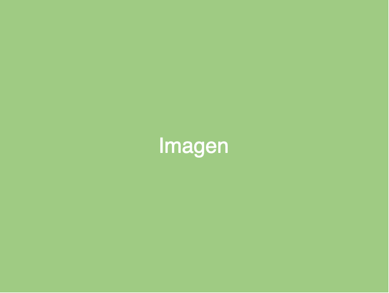

<!-- _class: lead -->

# OTRO TITULO 
##
##
##
##
## Arquitectura Basada en Microservicios
**Área de infraestructura
Programa de Ingeniería de Sistemas y Computación
Facultad de Ingeniería**

---

# Titulo temporal

### Prueba

---

# Imagen flotante

- uno
- dos
- tres
- cuatro
- cinco
- seis
- ocho

---

## Imagen centrada

- uno

---

<!-- _class: columns-2 -->

# Dos columnas con texto a la derecha

  

  
  

  

  ### texto a la derecha

  - 1
  - 2

  

---

<!-- _class: columns-2-grid -->

# Dos columnas con texto a la derecha

  

  
  

  

  ### texto a la derecha

  - 1
  - 2

  

---

<!-- _class: columns-flex -->

# Dos columnas con texto a la derecha

  

  
  

  

  ### texto a la derecha

  - 1
  - 2

  

---

# Cambio de tamaño de letra
  - Es posible cambiar el tamaño de la fuente 
  - 2

---

<!--_class: titulo -->

# Sub titulo

---

<!--_class: columns-3-grid -->

# Dos filas, tres columnas

  

  
   - Col 1
  

  

  
   - Col 2
  

  

  
   - Col 3
  

  
  

  
  

  

  
  

  

  
  

  

---

<!-- _class: columns-3-grid h2-center -->

## Dos filas, tres columnas

  
  

  
   - Col 1
  

  

  
   - Col 2
  

  

  
   - Col 3
  

  

  
  

  
  

  

  
  

  

  
  

  
---

<!-- _class: end -->

**Sub titulo de la presentación**  
Ingeniería de Sistemas y Computación
Universidad del Quindío  

 2025 [**Christian Andrés Candela Uribe**](mailto:christiancandela@uniquindio.edu.co)

